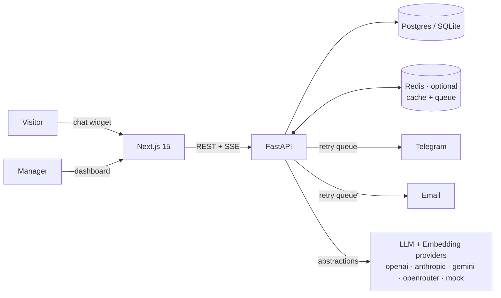

# 🧭 AI Client Intake Platform

[](.github/workflows/ci.yml)
[](backend/)
[](frontend/)
[](backend/tests/)
[](LICENSE)

A **multi-tenant SaaS platform** that replaces static contact forms with an intelligent
conversational interface. An AI agent interviews prospects 24/7, adapts its questions,
qualifies and scores every lead, and hands your team a structured summary — with a
built-in **kanban CRM**, **Telegram/email/in-app notifications**, **prompt management
with versioning**, **semantic knowledge-base retrieval**, **AI analytics** and full
**white-label branding** per workspace.

> Runs fully offline out of the box (deterministic mock AI, SQLite, in-memory cache) —
> and scales up to Postgres + Redis + your choice of OpenAI / Anthropic / Gemini /
> OpenRouter purely through configuration.

## ✨ Features

| Module | Highlights |
|---|---|
| 💬 **AI Chat Widget** | SSE streaming, typing indicator, quick replies, file uploads, EN/UK auto-detection, white-label colors & bot name |
| 🔀 **Dynamic Workflows** | JSON-defined flows: per-language prompts, typed answer validation, keyword branching, clarification of vague answers — editable in the admin UI |
| 🧠 **Prompt Management** | Versioned prompts, one-click activate / rollback, offline test bench, per-workflow assignment |
| 🤖 **Multi-AI Provider** | OpenAI, Anthropic, Gemini, OpenRouter or deterministic mock — switchable at runtime per workspace |
| 📚 **Semantic Knowledge Base** | Embedding-provider abstraction + pluggable vector store; hybrid semantic + lexical scoring; offline hashing fallback; one-click reindex |
| 🧵 **AI Memory** | Short-term verbatim window + LLM-compressed rolling summary, token-budgeted, persisted per conversation |
| 📋 **CRM v2** | Kanban pipeline with drag & drop, custom stages per workspace, tags, priorities, follow-up reminders, internal comments, activity timeline, full-text search |
| ▶️ **Conversation Replay** | Step-by-step replay with timestamps, workflow-node metadata, KB-match scores, attachments and CRM events on one timeline |
| 🔔 **Notification Center** | In-app bell + email + Telegram behind one dispatch API; queue-backed retries with exponential backoff; per-message delivery log; Slack/Discord registry slots |
| 📱 **Telegram Bot** | New-lead alerts with ✅/❌/📞 inline actions, deep links into the CRM, status-change updates, `/note` command, secret-protected webhook |
| ✉️ **Email v2** | Provider abstraction (SMTP + console; extensible), branded HTML templates with plain-text alternative, delivery status tracking |
| 📊 **Analytics + AI Analytics** | KPIs, leads/day, conversion funnel, drop-off by workflow node, conversation length, lead quality bands, AI capture confidence, common client questions |
| 🏢 **Multi-Tenant Workspaces** | Isolated data per company: leads, KB, workflows, prompts, settings, branding, audit — 404-on-cross-tenant by construction |
| 🎨 **White Label** | Per-workspace company name, bot name, logo, primary color, landing texts, email branding |
| 🛡️ **Security** | Rotating refresh tokens, login lockout, RBAC + tenancy checks, audit log with actor/IP, security headers, sanitized inputs, rate limiting |
| ⚡ **Redis (optional)** | Cluster-wide rate limits, caches and task queue when `REDIS_URL` is set; transparent in-memory fallback when it isn't |

## 🏗 Architecture

See **[docs/ARCHITECTURE.md](docs/ARCHITECTURE.md)** for the full picture (diagrams,
tenancy model, determinism rationale, retrieval & delivery pipelines, auth design).



Key design decisions:

- **Deterministic core** — the intake flow is a JSON state machine; LLMs only rephrase,
  summarize and compress. Zero API keys ⇒ fully working product, unflaky tests.
- **Everything behind an interface** — `LLMProvider`, `EmbeddingProvider`, `VectorStore`,
  `EmailProvider`, `CacheBackend`, task queue, notification channels. Each has an
  offline fallback and a production implementation.
- **Stateless API** — conversation state, memory and queues live in DB/Redis, so
  replicas scale horizontally.

## 🚀 Quick start

### Docker (Postgres + Redis + backend + frontend)

```bash
git clone <repo-url> && cd ai-client-intake-platform
cp .env.example .env
docker compose up --build
```

### Local dev (zero dependencies beyond Python + Node)

```bash
# Backend — http://localhost:8000 (Swagger at /docs)
cd backend
python -m venv .venv && .venv/Scripts/activate    # Linux/macOS: source .venv/bin/activate
pip install -r requirements-dev.txt
python -m app.seed                                 # demo data
uvicorn app.main:app --reload

# Frontend — http://localhost:3000
cd frontend && npm install && npm run dev
```

Open **http://localhost:3000** (chat widget bottom-right).
Admin: **/admin** — `admin@example.com` / `admin12345`. Seeded manager: `manager@example.com` / `manager123`.

Existing v1 databases upgrade automatically on first start (additive migrator,
no data loss).

### Enabling production integrations

| Integration | How |
|---|---|
| Real LLM | Set the provider key in `.env`, pick provider/model in **Settings → AI** |
| Semantic embeddings | `EMBEDDING_PROVIDER=openai` (or gemini/openrouter) + key, then **KB → Reindex** |
| Redis | `REDIS_URL=redis://…` — rate limits, caches and the delivery queue go cluster-wide |
| Telegram | Bot token in `.env`, chat ID in **Settings → Notifications**, register webhook: `https://api.telegram.org/bot<token>/setWebhook?url=https://<host>/api/webhook/telegram&secret_token=<TELEGRAM_WEBHOOK_SECRET>` |
| Email | `SMTP_*` in `.env` — branded HTML + plain-text alternative |

## 📡 API overview

Interactive OpenAPI docs at `/docs`. Highlights (🔒 = JWT, 👑 = admin):

| Area | Endpoints |
|---|---|
| Public | `POST /api/chat/start` · `POST /api/chat/{id}/msg` · `GET /api/chat/{id}/stream` (SSE) · `POST /api/chat/{id}/upload` · `GET /api/public/branding` |
| Auth | `POST /api/auth/login` · `POST /api/auth/refresh` (rotating) · `POST /api/auth/logout` · `GET /api/auth/me` |
| CRM 🔒 | `GET /api/leads` (status/priority/tag/search filters) · `GET /api/leads/pipeline` (kanban) · `GET/PATCH /api/leads/{id}` · `POST /api/leads/{id}/notes` · `GET /api/leads/{id}/replay` |
| Prompts 👑 | `GET/POST /api/prompts` · `POST /api/prompts/{id}/activate|deactivate` · `POST /api/prompts/test` |
| KB | `GET/POST/PUT/DELETE /api/kb` 👑 · `GET /api/kb/search` 🔒 · `POST /api/kb/reindex` 👑 |
| Notifications 🔒 | `GET /api/notifications` · `POST /api/notifications/{id}/read` · `read-all` · `GET /api/notifications/deliveries` |
| Analytics 🔒 | `GET /api/analytics/summary` · `GET /api/analytics/ai` |
| Admin 👑 | `GET/PUT /api/settings` · `GET /api/audit` · users CRUD + role changes · workflows CRUD |
| Integrations | `POST /api/webhook/telegram` (secret-token protected) · `GET /health` |

## 🧪 Testing & quality

```bash
cd backend && ruff check app tests && pytest --cov=app   # 66 tests
cd frontend && npm run lint && npm run build
```

- The suite runs with **zero API keys and zero external services** — mock LLM,
  hashing embeddings, console email, in-memory cache/queue.
- Coverage spans: workflow engine, chat E2E (EN+UK), tenancy isolation, refresh-token
  rotation/replay, prompts versioning/rollback, kanban/custom statuses/tags, replay
  timeline, notification center + delivery logs, queue retry, semantic KB, memory
  compression, audit trail, Telegram webhook.

## 📁 Project structure

```
backend/app/
  api/          # routers: auth, chat, leads, prompts, notifications, audit, kb, …
  core/         # config, security (JWT+refresh), cache, queue, rate limiting
  services/     # chat, workflow engine, llm, embeddings, vectorstore, kb, memory,
                # notifications, telegram, email, prompts, audit, analytics, scoring
  db_migrate.py # additive auto-migrator (v1 → v2 data-preserving)
frontend/app/   # landing + /admin (kanban CRM, analytics, prompts, audit, settings…)
docs/           # ARCHITECTURE.md
```

## 📚 More docs

[ARCHITECTURE](docs/ARCHITECTURE.md) · [CONTRIBUTING](CONTRIBUTING.md) ·
[SECURITY](SECURITY.md) · [ROADMAP](ROADMAP.md) · [CHANGELOG](CHANGELOG.md)

## 📄 License

[MIT](LICENSE)
