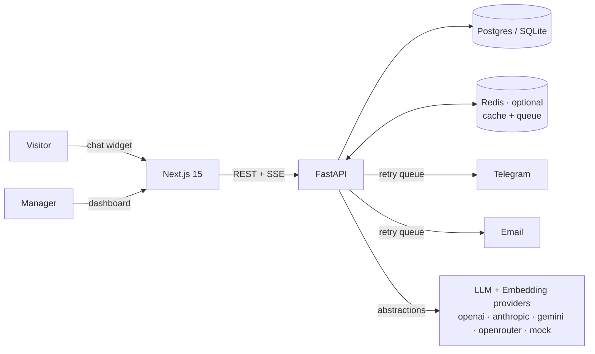

# 🧭 AI Client Intake Platform

[](.github/workflows/ci.yml)
[](backend/)
[](frontend/)
[](backend/tests/)
[](backend/tests/)
[](LICENSE)

### 🔗 [Project site](https://spqr2024.github.io/ai-client-intake-platform/) · [Telegram bot](https://t.me/aiclient_intake_bot) · [Documentation](#-more-docs) · [API reference](docs/API.md)

A **multi-tenant SaaS platform** that replaces static contact forms with an intelligent
conversational interface. An AI agent interviews prospects 24/7, adapts its questions,
qualifies and scores every lead, and hands your team a structured summary — with a
built-in **kanban CRM**, **Telegram/email/in-app notifications**, **prompt management
with versioning**, **semantic knowledge-base retrieval**, **AI analytics** and full
**white-label branding** per workspace.

> Runs fully offline out of the box (deterministic mock AI, SQLite, in-memory cache) —
> and scales up to Postgres + Redis + your choice of OpenAI / Anthropic / Gemini /
> OpenRouter purely through configuration.

**`DEMO_MODE=true` (the default in `.env.example`) provisions a populated demo
workspace on first start** — 12 leads across the pipeline, full chat transcripts,
analytics, a knowledge base and notifications — so the dashboard looks alive the
moment you clone it.

## ✨ Features

| Module | Highlights |
|---|---|
| 💬 **AI Chat Widget** | SSE streaming, typing indicator, quick replies, file uploads, EN/UK auto-detection, white-label colors & bot name |
| 🔀 **Visual Workflow Builder** | Compose intake flows from step cards — question text per language, answer type, quick replies, branching rules, reordering — with live structural validation (unreachable steps, loops, dead ends), 5 industry templates, a step library and a dry-run simulator. JSON editing is an optional "Advanced" toggle, never a requirement |
| 🧠 **Prompt Management** | Versioned prompts, one-click activate / rollback, offline test bench, per-workflow assignment |
| 🤖 **Multi-AI Provider** | OpenAI, Anthropic, Gemini, OpenRouter or deterministic mock — switchable at runtime per workspace |
| 📚 **Document Knowledge Base** | Upload **PDF / DOCX / Markdown / TXT** (or type articles); paragraph-aware chunking; embedding-provider abstraction + pluggable vector store; hybrid semantic + lexical retrieval; per-document indexing status, version history with restore, metadata, and retrieval analytics including *questions the KB could not answer* |
| 🔗 **CRM Integrations** | Provider registry with **HubSpot, Pipedrive, Notion, Salesforce and generic-webhook** adapters; queue-backed export with retry and a per-lead sync log. Adding a CRM is one class + one `register_provider` call — no provider is referenced anywhere else |
| 📈 **Operations** | Separate liveness/readiness probes, Prometheus `/metrics` with zero vendor dependencies, request-id correlation across structured JSON logs, and a pluggable error-reporting seam (Sentry in ~3 lines) |
| 🧵 **AI Memory** | Short-term verbatim window + LLM-compressed rolling summary, token-budgeted, persisted per conversation |
| 📋 **CRM v2** | Kanban pipeline with drag & drop, custom stages per workspace, tags, priorities, follow-up reminders, internal comments, activity timeline, full-text search |
| ▶️ **Conversation Replay** | Step-by-step replay with timestamps, workflow-node metadata, KB-match scores, attachments and CRM events on one timeline |
| 🔔 **Notification Center** | In-app bell + email + Telegram behind one dispatch API; queue-backed retries with exponential backoff; per-message delivery log; Slack/Discord registry slots |
| 📱 **Telegram Bot** | A full second front-end — see [below](#-telegram-bot). Lead alerts with ✅/❌/📞 inline actions, the pipeline runnable from your phone (`/leads`, `/lead`, `/stats`, `/setstatus`), conversation with the AI assistant grounded in your knowledge base, **prospect intake through Telegram** producing real scored leads, plus a daily digest and follow-up reminders |
| ✉️ **Email v2** | Provider abstraction (SMTP + console; extensible), branded HTML templates with plain-text alternative, delivery status tracking |
| 📊 **Analytics + AI Analytics** | KPIs, leads/day, conversion funnel, drop-off by workflow node, conversation length, lead quality bands, AI capture confidence, common client questions |
| 🏢 **Multi-Tenant Workspaces** | Isolated data per company: leads, KB, workflows, prompts, settings, branding, audit — 404-on-cross-tenant by construction |
| 🎨 **White Label** | Per-workspace company name, bot name, logo, primary color, landing texts, email branding |
| 🛡️ **Security** | Rotating refresh tokens, login lockout, RBAC + tenancy checks, audit log with actor/IP, security headers, sanitized inputs, rate limiting |
| ⚡ **Redis (optional)** | Cluster-wide rate limits, caches and task queue when `REDIS_URL` is set; transparent in-memory fallback when it isn't |

## 🏗 Architecture

See **[docs/ARCHITECTURE.md](docs/ARCHITECTURE.md)** for the full picture (diagrams,
tenancy model, determinism rationale, retrieval & delivery pipelines, auth design).



Key design decisions:

- **Deterministic core** — the intake flow is a JSON state machine; LLMs only rephrase,
  summarize and compress. Zero API keys ⇒ fully working product, unflaky tests.
- **Everything behind an interface** — `LLMProvider`, `EmbeddingProvider`, `VectorStore`,
  `EmailProvider`, `CacheBackend`, task queue, notification channels. Each has an
  offline fallback and a production implementation.
- **Stateless API** — conversation state, memory and queues live in DB/Redis, so
  replicas scale horizontally.

## 🧱 Tech stack

| Layer | Choice | Why |
|---|---|---|
| **API** | FastAPI · Python 3.12 · SQLAlchemy 2 (typed ORM) · Pydantic v2 | Async-native, generates OpenAPI for free, typed models end to end |
| **Web** | Next.js 15 (App Router) · React 19 · TypeScript strict · Tailwind v4 | Server-rendered public page for SEO, client-side dashboard, one toolchain |
| **Data** | PostgreSQL (prod) · SQLite (dev, zero-config) | Same SQLAlchemy code path both ways; nothing to install to start |
| **Cache / queue** | Redis, optional | Cluster-wide rate limits and durable retries; degrades to in-process |
| **AI** | OpenAI · Anthropic · Gemini · OpenRouter · offline mock | Provider-agnostic behind one interface; the mock keeps tests deterministic |
| **Tests** | pytest + coverage gate · Vitest + Testing Library | 272 tests (241 backend + 31 frontend), no API keys or network required |
| **Quality** | Ruff (lint + format) · ESLint · tsc strict · pre-commit | Enforced in CI, not by convention |
| **Ops** | Docker (non-root, multi-stage) · Compose · GitHub Actions · Prometheus `/metrics` | Reproducible builds, dependency audits, image scanning in CI |

## 🚀 Quick start

### Docker (Postgres + Redis + backend + frontend)

```bash
git clone https://github.com/spqr2024/ai-client-intake-platform.git
cd ai-client-intake-platform
cp .env.example .env
docker compose up --build
```

### Installation — local dev (nothing beyond Python 3.12 + Node 22)

```bash
# Backend — http://localhost:8000 (Swagger at /docs)
cd backend
python -m venv .venv && .venv/Scripts/activate    # Linux/macOS: source .venv/bin/activate
pip install -r requirements-dev.txt
python -m app.seed                                 # demo data
uvicorn app.main:app --reload

# Frontend — http://localhost:3000
cd frontend && npm install && npm run dev
```

Open **http://localhost:3000** (chat widget bottom-right).
Admin: **/admin** — `admin@example.com` / `admin12345`. Seeded manager: `manager@example.com` / `manager123`.

Existing databases upgrade automatically on first start (additive migrator,
no data loss).

With `make` available, every routine task has a shortcut — run `make help`:

```bash
make setup     # install backend + frontend dependencies
make demo      # API with a freshly provisioned demo workspace
make frontend  # web app in dev mode
make check     # everything CI runs: lint + types + all tests
make format    # ruff format + prettier
make docker-up # full stack: Postgres + Redis + API + web
make doctor    # verify .env credentials against the live providers
```

## 🔌 Going live with real credentials

The platform runs with none, so wiring providers in is an upgrade, not a
prerequisite. Copy `.env.example` to `.env`, fill in what you have, then let the
preflight tell you whether it actually works:

```bash
make doctor        # read-only checks against every configured provider
make doctor-send   # also delivers one real Telegram message + email
```

```
  + OK   JWT_SECRET      64 chars
  + OK   AI provider     openrouter/openai/gpt-oss-20b:free replied 'OK'
  - SKIP Embeddings      offline hashing embedder (no key needed)
  + OK   Telegram bot    @your_intake_bot
  ! WARN Telegram chat   TELEGRAM_CHAT_ID unset - send /start to the bot, then re-run
  + OK   Email/SMTP      authenticated as you@example.com on smtp.gmail.com
  + OK   CRM export      hubspot token accepted
```

Unconfigured integrations report `SKIP` rather than failing, so the command is
meaningful on a zero-key install too. It exits non-zero only on a real failure,
which makes it usable as a deploy gate:

```bash
python -m app.doctor || exit 1
```

Notes on individual providers:

| Provider | Getting the credential |
|---|---|
| **Telegram** | Create a bot with [@BotFather](https://t.me/BotFather) → `TELEGRAM_BOT_TOKEN`. For `TELEGRAM_CHAT_ID`, send the bot a message and re-run `make doctor` — it lists the chats that have written to it. **`TELEGRAM_CHAT_ID` is not the bot's id** (the number before the colon in the token): a bot cannot message itself, so that value silently delivers nothing. It is the id of the person or group receiving alerts. |
| **AI provider** | Set `AI_PROVIDER` to `openai`/`anthropic`/`gemini`/`openrouter` and the matching `*_API_KEY`. Leave `AI_MODEL` empty to use the verified default for that provider. |
| **Email** | Gmail needs an [app password](https://support.google.com/accounts/answer/185833), not your account password; spaces in it are optional. Leave `SMTP_HOST` empty to log emails to the console instead. |
| **CRM** | `CRM_PROVIDER=hubspot` plus a private-app token in `CRM_API_KEY`. Anything set in **Settings → Integrations** overrides the env value. |

> Free-tier AI keys are rate-limited per minute and per day. If the doctor reports
> `429`, the credential is valid — the quota is not. The deterministic mock provider
> keeps the product fully functional in the meantime.

## 🎭 Demo mode

`DEMO_MODE=true` (default in `.env.example`) provisions a complete, believable
workspace the first time the API starts against an empty database:

- **12 leads** spread across every pipeline stage, with realistic budgets,
  tags, priorities and follow-up reminders
- **Full chat transcripts** with replay metadata, including a Ukrainian
  conversation and four drop-offs so funnel/abandonment analytics are non-trivial
- **5 knowledge-base articles**, indexed at boot so the bot answers FAQs immediately
- **Branding, notifications and activity history** already populated

It is **idempotent** (re-running never duplicates) and **inert once real data
exists** (it only seeds a workspace with zero leads). Turn it off in production.

```bash
make demo                       # or: DEMO_MODE=true uvicorn app.main:app
# Admin dashboard → admin@example.com / admin12345
```

For a scripted, non-random dataset instead, use `make seed`.

### Enabling production integrations

| Integration | How |
|---|---|
| Real LLM | Set the provider key in `.env`, pick provider/model in **Settings → AI** |
| Semantic embeddings | `EMBEDDING_PROVIDER=openai` (or gemini/openrouter) + key, then **KB → Reindex** |
| Redis | `REDIS_URL=redis://…` — rate limits, caches and the delivery queue go cluster-wide |
| Telegram | Bot token + chat id in `.env` (or **Settings → Notifications**), then `python -m app.telegram_bot set-webhook https://<host>` |
| Email | `SMTP_*` in `.env` — branded HTML + plain-text alternative |

## 🚢 Deployment

**[render.yaml](render.yaml)** describes the whole stack — API, dashboard,
PostgreSQL and Redis. Render → *New → Blueprint* → pick this repository. Every
secret is declared `sync: false` so Render prompts for it once and stores it
encrypted; `JWT_SECRET` and `TELEGRAM_WEBHOOK_SECRET` are machine-generated, so
no human ever picks them.

Set **`ENVIRONMENT=production`** and the API *refuses to boot* on unsafe
configuration rather than serving traffic while insecure:

```
RuntimeError: Unsafe configuration for ENVIRONMENT=production:
  - JWT_SECRET is still the documented placeholder - anyone can forge tokens.
  - DEMO_MODE=true seeds fake leads - turn it off in production.
```

It also catches `DEBUG=true`, wildcard or localhost `CORS_ORIGINS`, a non-HTTPS
`PUBLIC_APP_URL`, and a Telegram token with no webhook secret. In any other
environment the same problems are warnings, so a fresh clone still starts with
zero configuration.

The dashboard is `output: "standalone"` — a **server** app. GitHub Pages hosts
only the marketing page in `site/`; the application itself needs a Node runtime
(Render, Vercel, Fly, or the provided container).

Full checklist, Compose, Kubernetes sketch, backups and rollback:
**[docs/DEPLOYMENT.md](docs/DEPLOYMENT.md)**.

## 📱 Telegram bot

Live bot: **[@aiclient_intake_bot](https://t.me/aiclient_intake_bot)**

The bot is a second front-end, not a notifier. Every chat resolves to one of two
roles, and they have **disjoint** capabilities:

| | **Manager** — a configured chat id | **Prospect** — anyone else |
|---|---|---|
| Lead commands, notes, Accept/Reject | ✅ | ❌ never |
| Conversation with the AI assistant | ✅ | ❌ never |
| Interviewed by Nora, creating a lead | — | ✅ |

The webhook secret proves an update came from *Telegram*; it says nothing about
*who* sent it, and anyone can DM a public bot. So the role decides everything —
a prospect never reaches a branch that reads or writes CRM state, and the
greeting they receive never names a managerial command.

### Manager commands

| Command | Does |
|---|---|
| `/leads [status]` | 10 most recent, optionally filtered — e.g. `/leads Qualified` |
| `/lead <id>` | Full detail with the Accept / Reject / Call actions |
| `/stats` | 30-day pipeline summary |
| `/setstatus <id> <status>` | Move a lead — audited and fanned out exactly like a dashboard change |
| `/note <id> <text>` | Attach a note to a lead |
| *(plain message)* | Ask the assistant anything — answered from your knowledge base |
| `/clear` | Forget the assistant conversation |
| `/start` · `/help` · `/status` | Connection and integration state |

Status names come from the workspace's `pipeline_statuses` setting, so a
customised pipeline is followed automatically. Every query is workspace-scoped:
a manager cannot reach another tenant's lead by guessing an id.

### Prospect intake

A chat that is not a configured manager is interviewed by **the same workflow
state machine the web widget uses**, and a completed interview produces a real
scored lead with the normal notification fan-out. Conversation state is
persisted (`conversations.external_ref`), so an interview survives a restart
instead of looping on the first question.

> **This gives your CRM a public write path.** Anyone who finds the bot can
> start an interview and create a lead. Intake is rate-limited to 20 messages
> per minute per chat (cluster-wide when Redis is configured); consider whether
> that is the posture you want before publishing the bot's username.

### Scheduled nudges

- **Follow-up reminders** when a lead's `follow_up_at` arrives.
- **Daily digest** of new leads at `DIGEST_HOUR` (UTC, default 09), off via `DIGEST_ENABLED=false`.

Both are idempotent from persisted state rather than scheduling precision: the
driving loop ticks every 15 minutes and may run after a restart, so a delivered
reminder is recorded on the lead and the digest consults the notification log.
A *failed* send is deliberately not marked, so the next tick retries it. Quiet
days send nothing — a digest that reports "0 leads" every morning trains you to
ignore it.

### Operating the bot

```bash
python -m app.telegram_bot info               # bot, webhook, authorized chats
python -m app.telegram_bot set-webhook https://api.example.com   # production
python -m app.telegram_bot delete-webhook
python -m app.telegram_bot poll               # local dev, no public URL needed
python -m app.telegram_bot register-commands  # publish the / menu
```

Webhook and polling are mutually exclusive — Telegram serves `getUpdates` only
when no webhook is registered, and `poll` refuses to start if one is.

> **`TELEGRAM_CHAT_ID` is not the bot's own id** (the number before the colon in
> the token). A bot cannot message itself: Telegram answers *"the bot can't send
> messages to the bot"* and nothing is ever delivered. `info` detects this
> specific mistake and says so.

> **`PUBLIC_APP_URL` must be a publicly resolvable HTTPS URL** for the "Open in
> CRM" button. Telegram rejects `localhost` links — and rejects the *entire*
> message, taking the Accept/Reject/Call actions down with it. The button is
> dropped with a warning rather than losing the card.

## 📡 API overview

Interactive OpenAPI docs at `/docs`. Highlights (🔒 = JWT, 👑 = admin):

| Area | Endpoints |
|---|---|
| Public | `POST /api/chat/start` · `POST /api/chat/{id}/msg` · `GET /api/chat/{id}/stream` (SSE) · `POST /api/chat/{id}/upload` · `GET /api/public/branding` |
| Operations | `GET /health` · `GET /health/live` · `GET /health/ready` · `GET /metrics` (Prometheus) · `GET /metrics/json` |
| KB documents 👑 | `POST /api/kb/upload` (PDF/DOCX/MD/TXT) · `GET /api/kb/stats` · `GET /api/kb/{id}/versions` · `POST /api/kb/{id}/versions/{v}/restore` · `POST /api/kb/{id}/reindex` |
| Workflow builder 👑 | `GET /api/workflows/templates` · `POST /api/workflows/analyze` · `POST /api/workflows/simulate` |
| CRM export | `GET /api/crm/providers` · `GET /api/crm/syncs` 🔒 · `POST /api/crm/leads/{id}/export` 👑 |
| Auth | `POST /api/auth/login` · `POST /api/auth/refresh` (rotating) · `POST /api/auth/logout` · `GET /api/auth/me` |
| CRM 🔒 | `GET /api/leads` (status/priority/tag/search filters) · `GET /api/leads/pipeline` (kanban) · `GET/PATCH /api/leads/{id}` · `POST /api/leads/{id}/notes` · `GET /api/leads/{id}/replay` |
| Prompts 👑 | `GET/POST /api/prompts` · `POST /api/prompts/{id}/activate|deactivate` · `POST /api/prompts/test` |
| KB | `GET/POST/PUT/DELETE /api/kb` 👑 · `GET /api/kb/search` 🔒 · `POST /api/kb/reindex` 👑 |
| Notifications 🔒 | `GET /api/notifications` · `POST /api/notifications/{id}/read` · `read-all` · `GET /api/notifications/deliveries` |
| Analytics 🔒 | `GET /api/analytics/summary` · `GET /api/analytics/ai` |
| Admin 👑 | `GET/PUT /api/settings` · `GET /api/audit` · users CRUD + role changes · workflows CRUD |
| Integrations | `POST /api/webhook/telegram` (secret-token protected) · `GET /health` |

## 🧪 Testing & quality

```bash
cd backend && ruff check app tests && pytest --cov=app   # 241 tests, 81% coverage
cd frontend && npm run lint && npm run test:run && npm run build   # 31 tests
```

- The suite runs with **zero API keys and zero external services** — mock LLM,
  hashing embeddings, console email, in-memory cache/queue.
- Coverage spans: workflow engine, chat E2E (EN+UK), tenancy isolation, refresh-token
  rotation/replay, prompts versioning/rollback, kanban/custom statuses/tags, replay
  timeline, notification center + delivery logs, queue retry, semantic KB, memory
  compression, audit trail, and the Telegram bot end to end — webhook auth, the
  manager/prospect role split, lead commands, assistant grounding, intake, and
  reminder idempotency.
- Two sweeps guard the boundaries rather than individual cases: every route in
  the OpenAPI schema must refuse an anonymous caller, and `.env.example` must
  document every `Settings` field (the config ignores unknown keys, so drift is
  otherwise silent).

## 📁 Project structure

```
backend/app/
  api/            # routers: auth, chat, leads, prompts, notifications, audit, kb, …
  core/           # config (+ production safety checks), security (JWT+refresh),
                  # cache, queue, rate limiting, structured logging
  services/       # chat, workflow engine, llm, embeddings, vectorstore, kb, memory,
                  # notifications, telegram, reminders, email, prompts, audit,
                  # analytics, scoring
  db_migrate.py   # additive auto-migrator (data-preserving)
  doctor.py       # credential preflight against live providers
  telegram_bot.py # bot operations CLI (info / set-webhook / poll / …)
frontend/app/     # landing + /admin (kanban CRM, analytics, prompts, audit, settings…)
docs/             # architecture, API, deployment, troubleshooting, brand, portfolio
site/             # the project page published to GitHub Pages
render.yaml       # one-click Render blueprint: API, web, Postgres, Redis
```

## 📸 Screenshots

> **Status:** this repository was built in a headless environment with no
> browser automation, so the images are captured locally rather than committed
> pre-baked — which also guarantees they always match your checkout.
> **[docs/SCREENSHOTS.md](docs/SCREENSHOTS.md)** specifies every route, state,
> viewport and filename, plus a copy-paste checklist. Two commands and about
> fifteen minutes produce the full set.

```bash
make demo        # API on :8000 with a fully populated demo workspace
make frontend    # web app on :3000  →  admin@example.com / admin12345
```

**The views worth capturing** — each one proves a different claim:

| View | Route | What it demonstrates |
|---|---|---|
| Conversational intake | `/` | Adaptive questions, quick replies, SSE streaming |
| Kanban pipeline | `/admin` → Kanban | A real CRM board, not a lead list |
| Lead detail | `/admin/leads/1` | AI summary feeding a workable record |
| Conversation replay | `/admin/leads/1` → Replay | Step-by-step playback with workflow-node metadata |
| AI analytics | `/admin/analytics` | Funnel, drop-off by node, capture confidence |
| Visual workflow builder | `/admin/workflows` | Non-engineers editing the bot, with live validation |
| Knowledge base | `/admin/kb` | Document ingestion with real indexing status |
| Integrations | `/admin/settings` → Integrations | CRM adapters and the delivery log |
| Mobile dashboard | `/admin` @ 393×852 | Genuine responsive layout, not a squeezed table |

Four short GIF walkthroughs are scripted in the same guide: visitor → qualified
lead, kanban management, editing the bot without code, and teaching the bot from
an uploaded PDF.

## ❓ FAQ

<details>
<summary><b>Do I need an OpenAI key to run this?</b></summary>

No. The default `mock` provider is a deterministic offline implementation, and
the whole test suite runs without a single API key. Intake logic is a state
machine, so the product is fully functional offline — an LLM only rephrases
questions, writes summaries and compresses memory. Add a key when you want
those touches.
</details>

<details>
<summary><b>Why is the conversation a state machine instead of "just an LLM"?</b></summary>

Three reasons that matter commercially: lead capture stays **reproducible**
(the same answers always produce the same lead), it cannot be **prompt-injected**
into skipping qualification steps, and the product **still works** when a
provider has an outage. LLMs improve the phrasing; they are not load-bearing.
</details>

<details>
<summary><b>Is it really multi-tenant?</b></summary>

Yes. `workspace_id` is on every domain table, every authenticated query filters
by the caller's workspace, and cross-tenant access returns **404 rather than
403** so record existence is never leaked. There are dedicated isolation tests.
</details>

<details>
<summary><b>Do I need Redis?</b></summary>

Only for multi-replica deployments. Without `REDIS_URL` the cache, rate limiter
and task queue run in-process with identical semantics; set it and they become
cluster-wide. Nothing in the application imports Redis directly.
</details>

<details>
<summary><b>How do I add a CRM, an AI provider or a notification channel?</b></summary>

Each is a registry: write one class and register it. A new CRM is a
`CRMProvider` subclass plus `register_provider(...)` — no existing file changes,
including the settings layer, which accepts a provider's option keys
dynamically. Same pattern for embeddings, email and notification channels.
</details>

<details>
<summary><b>Why isn't the knowledge base finding an obviously related document?</b></summary>

The default offline embedder is a feature-hasher: it matches morphological
variants ("refund"/"refunds"), not synonyms ("money back"). Set a real
`EMBEDDING_PROVIDER` and run **Re-index all** for true semantic recall. The
retrieval pipeline is identical either way. The KB dashboard also lists
**questions it could not answer** — each is a document you're missing.
</details>

<details>
<summary><b>Can this be deployed for a paying customer today?</b></summary>

Yes — see [DEPLOYMENT.md](docs/DEPLOYMENT.md), which starts with a pre-flight
checklist (rotate `JWT_SECRET`, disable demo mode, managed Postgres, TLS).
Containers run as non-root, readiness and liveness are separate probes, and
migrations are additive and idempotent. The known gaps are listed honestly in
[ROADMAP.md](ROADMAP.md).
</details>

<details>
<summary><b>Why an in-house migrator instead of Alembic?</b></summary>

Deliberate trade-off for this stage: the additive migrator makes clone-and-run
frictionless and is idempotent (CI verifies it across repeated runs). It never
drops a column older code reads, so image rollbacks stay safe. DEPLOYMENT.md
documents exactly how to graduate to Alembic when schema changes get riskier.
</details>

## ⚠️ Known limitations

Stated plainly, because a repository that hides its edges is harder to trust
than one that names them. Full table with remediation paths in
**[ROADMAP.md](ROADMAP.md#known-limitations)**.

| Limitation | What it means in practice |
|---|---|
| Offline embedder matches morphology, not synonyms | Out of the box, "money back" won't retrieve a "refund" article. Set `EMBEDDING_PROVIDER` + key and **Re-index all** for true semantic recall |
| Brute-force vector search | Comfortable to a few thousand chunks; linear beyond. `VectorStore` is the seam for pgvector |
| Tag filtering runs in Python | The JSON column is portable but not indexable; a Postgres `jsonb` + GIN index is the upgrade |
| No browser E2E or load tests | Unit and integration layers are thorough; concurrency behaviour is reasoned, not measured |
| Provider API keys live in workspace settings | Fine self-hosted; a shared SaaS should move them to a secret manager |
| Scanned PDFs are rejected | No OCR — the uploader says so explicitly rather than indexing an empty document |
| In-house additive migrator, not Alembic | Idempotent and CI-verified; [DEPLOYMENT.md](docs/DEPLOYMENT.md#5-database-migrations) documents the graduation path |

## 📚 More docs

**Engineering**
[Architecture](docs/ARCHITECTURE.md) · [API reference](docs/API.md) ·
[Security](SECURITY.md) · [Deployment](docs/DEPLOYMENT.md) ·
[Troubleshooting](docs/TROUBLESHOOTING.md) · [Disaster recovery](docs/DISASTER_RECOVERY.md)

**Project**
[Contributing](CONTRIBUTING.md) · [Roadmap](ROADMAP.md) · [Changelog](CHANGELOG.md) ·
[Releasing](docs/RELEASING.md)

**Presentation**
[Project site](https://spqr2024.github.io/ai-client-intake-platform/) ([source](site/index.html)) ·
[Case study](docs/portfolio/CASE_STUDY.md) · [Brand & visual identity](docs/BRAND.md) ·
[Screenshot capture guide](docs/SCREENSHOTS.md)

## 📄 License

[MIT](LICENSE)
