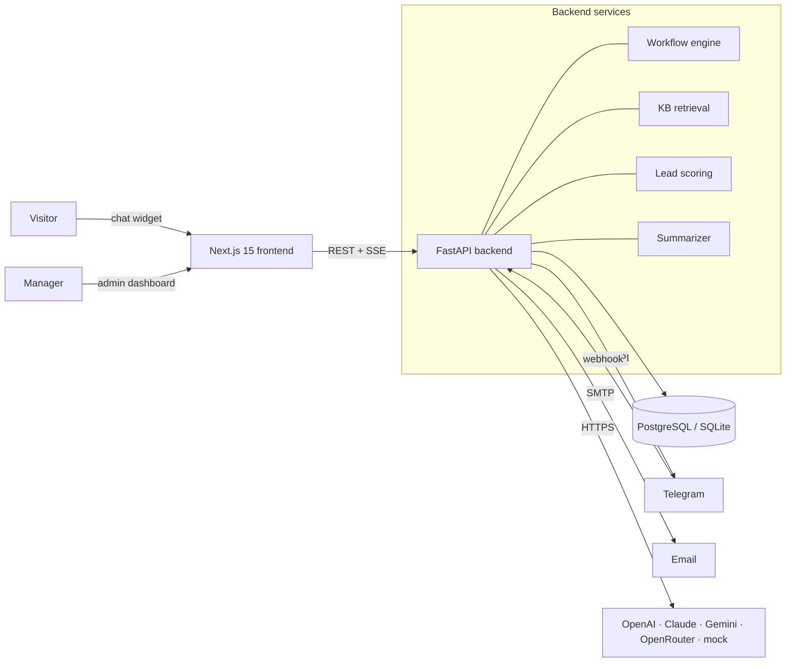
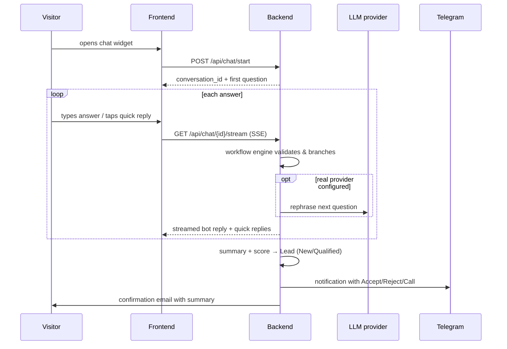
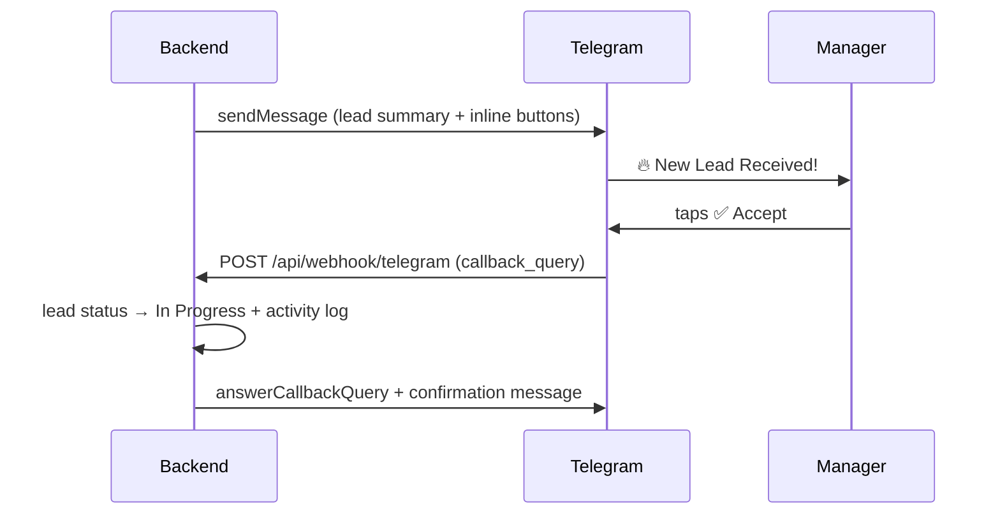

# 🧭 AI Client Intake Platform

[](.github/workflows/ci.yml)
[](backend/)
[](frontend/)
[](LICENSE)

A web platform that **replaces static contact forms with an intelligent conversational interface**. An AI chat agent interviews prospects 24/7, adapts its questions to their answers, qualifies and scores every lead, and hands your team a structured summary — with instant **Telegram notifications** (one-tap Accept / Reject / Call), **email confirmations**, a built-in **mini-CRM dashboard** and **analytics**.

> Static multi-page forms see >67% abandonment; conversational intake captures context and nuance, follows up on vague answers, and routes qualified leads to staff in seconds.

## ✨ Features

| Module | What it does |
|---|---|
| 💬 **AI Chat Widget** | Streaming (SSE) chat with typing indicator, quick-reply buttons, file uploads, EN/UK auto-detection |
| 🔀 **Dynamic Workflows** | Conversation flows are JSON data, not code — per-language prompts, answer validation (number/email/phone), keyword branching, editable in the admin UI |
| 🤖 **Multi-AI Provider** | OpenAI, Anthropic Claude, Google Gemini, OpenRouter — switchable at runtime; deterministic **mock mode runs fully offline** (no API key needed) |
| 🧾 **AI Summaries** | Every finished chat becomes a structured lead summary (LLM-generated, rule-based fallback) |
| ⭐ **Lead Scoring** | Deterministic 0–100 scoring (budget, urgency, completeness, contact info) with a configurable "Qualified" threshold |
| 📋 **Mini-CRM Dashboard** | Lead list with filters/search, full transcript, summary, attachments, activity timeline, notes, assignment, role-based access (admin/manager) |
| 📱 **Telegram Bot** | New-lead alerts with ✅ Accept / ❌ Reject / 📞 Call inline buttons; `/note <id> <text>` adds CRM notes from Telegram |
| ✉️ **Email** | Templated client confirmation + staff notification (SMTP, console fallback in dev) |
| 📚 **Knowledge Base** | Admin-managed FAQ articles; the bot answers off-script questions from the KB and returns to the flow |
| 📊 **Analytics** | Conversion/completion rates, average budget & score, leads per day, status & service breakdowns |
| ⚙️ **Runtime Settings** | System prompt, provider/model/temperature, email templates, thresholds — all editable in the UI, no redeploy |
| 🔐 **Security** | JWT auth, PBKDF2 password hashing, role-based access, input sanitization, rate limiting, Telegram webhook secret, CORS |

## 🏗 Architecture



**Design notes**

- The **workflow engine is a deterministic state machine** (JSON-defined nodes with validation and branching). The LLM layer only *rephrases* questions and writes summaries — intake logic never depends on LLM availability or mood, so the whole product works offline in `mock` mode and degrades gracefully when a provider fails.
- **API instances are stateless** — conversation state lives in the database, so the backend scales horizontally. The in-memory rate limiter is the one per-instance piece; swap it for Redis when running multiple replicas.
- Zero-config local development: with no `DATABASE_URL` the backend uses a local **SQLite** file; docker-compose provides **PostgreSQL**.

### Chat session flow



### Telegram interaction



## 🚀 Quick start

### Option A — Docker (recommended)

```bash
git clone <repo-url> && cd ai-client-intake-platform
cp .env.example .env          # defaults work out of the box (mock AI, SQLite→Postgres via compose)
docker compose up --build
```

### Option B — local dev (no Docker)

```bash
# backend (Python 3.12)
cd backend
python -m venv .venv && .venv/Scripts/activate   # Linux/macOS: source .venv/bin/activate
pip install -r requirements-dev.txt
python -m app.seed                                # optional: demo data
uvicorn app.main:app --reload                     # http://localhost:8000  (docs at /docs)

# frontend (Node 20+), second terminal
cd frontend
npm install
npm run dev                                       # http://localhost:3000
```

Open **http://localhost:3000** — chat widget bottom-right.
Admin dashboard: **http://localhost:3000/admin** — `admin@example.com` / `admin12345` (change in `.env`).
After seeding, a manager account also exists: `manager@example.com` / `manager123`.

### Enabling real integrations (all optional)

| Integration | How |
|---|---|
| Real LLM | Set `OPENAI_API_KEY` (or Anthropic/Gemini/OpenRouter key) in `.env`, then pick the provider in **Settings** or via `AI_PROVIDER` |
| Telegram | Create a bot via [@BotFather](https://t.me/BotFather), set `TELEGRAM_BOT_TOKEN` + `TELEGRAM_CHAT_ID`, and register the webhook: `https://api.telegram.org/bot<token>/setWebhook?url=https://<your-host>/api/webhook/telegram&secret_token=<TELEGRAM_WEBHOOK_SECRET>` |
| Email | Set `SMTP_HOST/PORT/USER/PASSWORD`; without it emails are logged to the console |

## 📡 API overview

Interactive OpenAPI docs at `http://localhost:8000/docs`. Key endpoints:

| Endpoint | Method | Description |
|---|---|---|
| `/api/chat/start` | POST | Start a conversation → `{conversation_id, bot_message, quick_replies}` |
| `/api/chat/{id}/msg` | POST | Send a message → bot reply (JSON) |
| `/api/chat/{id}/stream?text=` | GET | Send a message → bot reply streamed over SSE |
| `/api/chat/{id}/upload` | POST | Attach a file to the conversation |
| `/api/leads` | GET | List leads (filter by `status`, `search`) 🔒 |
| `/api/leads/{id}` | GET/PATCH | Lead detail (transcript, summary, activity) / update status, assignee 🔒 |
| `/api/leads/{id}/notes` | POST | Add internal note 🔒 |
| `/api/workflows` | CRUD | Manage conversation flows 🔒 admin |
| `/api/kb` | CRUD + `/search` | Knowledge-base articles 🔒 |
| `/api/analytics/summary` | GET | KPIs, per-day series, breakdowns 🔒 |
| `/api/settings` | GET/PUT | Runtime settings 🔒 admin |
| `/api/webhook/telegram` | POST | Telegram webhook (secret-token protected) |
| `/health` | GET | Health check (DB probe) |

## 🧪 Testing & quality

```bash
cd backend
pytest --cov=app          # 35 tests: workflow engine, chat E2E, auth/roles, KB, Telegram webhook, scoring
ruff check app tests      # lint

cd frontend
npm run lint && npm run build
```

- LLM calls are **never** exercised in tests — `mock` provider keeps them deterministic.
- CI (GitHub Actions) runs lint + tests + production builds + Docker image builds on every push.

## 📁 Project structure

```
backend/
  app/
    api/         # routers: auth, chat, leads, workflows, kb, analytics, settings, telegram, users, health
    core/        # config, JWT/passwords, rate limiting
    services/    # workflow engine, chat orchestration, llm providers, scoring, summary, kb, telegram, email
    models.py    # SQLAlchemy models (User, Lead, Conversation, Message, Workflow, KB, …)
    schemas.py   # Pydantic request/response contracts
    seed.py      # demo data
  tests/
frontend/
  app/           # Next.js app router: landing, /admin (leads, analytics, workflows, kb, settings)
  components/    # ChatWidget (SSE streaming, quick replies, uploads)
  lib/           # API client, i18n (EN/UK)
docker-compose.yml · .github/workflows/ci.yml · .env.example
```

## 🔐 Security highlights

- JWT (short TTL) + role-based authorization on every non-public endpoint
- PBKDF2-SHA256 password hashing (260k iterations), constant-time comparison
- User input sanitized (HTML stripped) before storage/LLM; UI renders text as React nodes, never `dangerouslySetInnerHTML`
- System prompts are server-side constants — user text never edits prompt templates (OWASP LLM01)
- Parameterized queries via SQLAlchemy ORM; upload type/size allow-listing
- Sliding-window rate limiting; Telegram webhook secret-token check; CORS origin allow-list

## 🗺 Roadmap

- [ ] CRM webhooks (HubSpot / Salesforce lead export)
- [ ] Embeddings-based KB retrieval (pgvector) behind the same `search()` interface
- [ ] Redis-backed rate limiting + session cache for multi-replica deployments
- [ ] Playwright E2E suite; Locust load tests
- [ ] Prometheus metrics endpoint + OpenTelemetry tracing
- [ ] Meeting scheduling step after chat completion

## 📄 License

[MIT](LICENSE)
