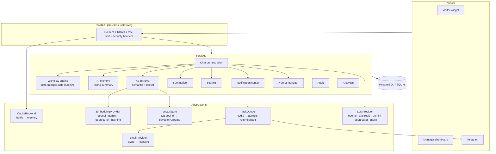

# Architecture

## Overview

The platform is a **modular monolith** with clean seams: FastAPI routers own HTTP concerns,
`app/services/*` own domain logic, and infrastructure (cache, queue, vector store, LLM and
email providers) is accessed only through abstractions. Every abstraction ships with a
zero-dependency fallback so the full product runs offline, and with a production backend
(Redis, real LLM/embedding providers, SMTP) enabled purely by configuration.

## Multi-tenancy

`Workspace` is the tenant root. Every domain table carries `workspace_id`; every
authenticated query filters on the caller's workspace (taken from the DB user record —
the JWT `ws` claim is informational). Public endpoints (chat start, branding) resolve a
workspace by slug. Cross-tenant access returns **404, never 403**, so existence is not
leaked.

Per-workspace state lives in `app_settings` (key/value): branding, pipeline stages,
notification templates, AI overrides — all editable at runtime without redeploys.

## Determinism as a design principle

The intake conversation is driven by a **JSON-defined state machine**
(`services/workflow.py`), not by an LLM. The LLM layer only (a) rephrases the next
question, (b) writes summaries, (c) compresses memory — every one of those calls has a
deterministic fallback. Consequences:

- the product works with zero API keys (mock mode) — demos and tests never flake;
- lead capture cannot be prompt-injected into skipping steps (OWASP LLM01);
- scoring/qualification is reproducible and auditable.

## Retrieval pipeline

`services/kb.py` blends two signals: cosine similarity over provider embeddings
(70%) and lexical query-coverage (30%). If embeddings are unavailable the lexical
score alone serves. Vectors live in the `kb_embeddings` table behind the
`VectorStore` interface — swapping in pgvector or Chroma touches one class.

## Delivery pipeline

All outbound messages (email, Telegram) flow through the **notification center**:
a `notifications` row is written first (the delivery log), then a `notify.deliver`
task is enqueued. The queue worker retries with exponential backoff (3 attempts)
and records status/attempts/error on the row. In-app notifications are written
synchronously for all workspace members. Slack/Discord are registry slots —
`register_channel(name, sender)` is the only integration point.

## Auth model

- Access: JWT, 30-minute TTL, carries `sub`/`role`/`ws`.
- Refresh: opaque 48-byte tokens, SHA-256-hashed at rest, **rotated on every use**;
  replay of a rotated token fails. Logout revokes; role changes revoke all sessions.
- Login: per-email+IP lockout via the cache backend.
- CSRF: not applicable by construction — no cookie-based auth; tokens travel in the
  `Authorization` header only. (Tradeoff: tokens in localStorage require the XSS
  hygiene enforced elsewhere — React-only rendering, input sanitization, CSP-friendly
  security headers.)

## Migrations

`app/db_migrate.py` is an additive-only migrator that runs before `create_all`:
new columns via `ALTER TABLE ADD COLUMN`, plus the one structural rebuild
(`app_settings` → workspace-scoped). Existing SQLite/Postgres data survives the
v1 → v2 upgrade untouched. Long-lived production deployments should graduate to
Alembic (see roadmap); the migrator keeps the demo/dev upgrade path frictionless.

## Scaling notes

API instances are stateless (conversation state and memory live in the DB), so
horizontal scaling = more replicas + `REDIS_URL` so rate limits, caches and the
task queue become cluster-wide. The brute-force vector search is O(articles) per
query — right-sized for FAQ corpora; the `VectorStore` interface is the seam for
a real ANN index when corpora grow.
